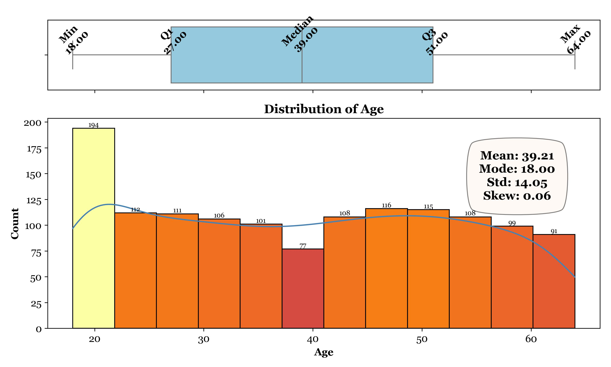
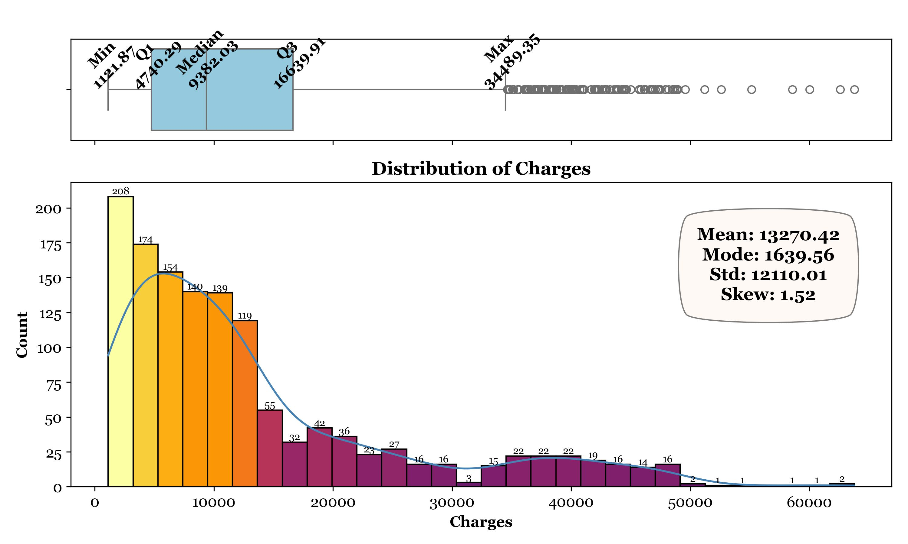
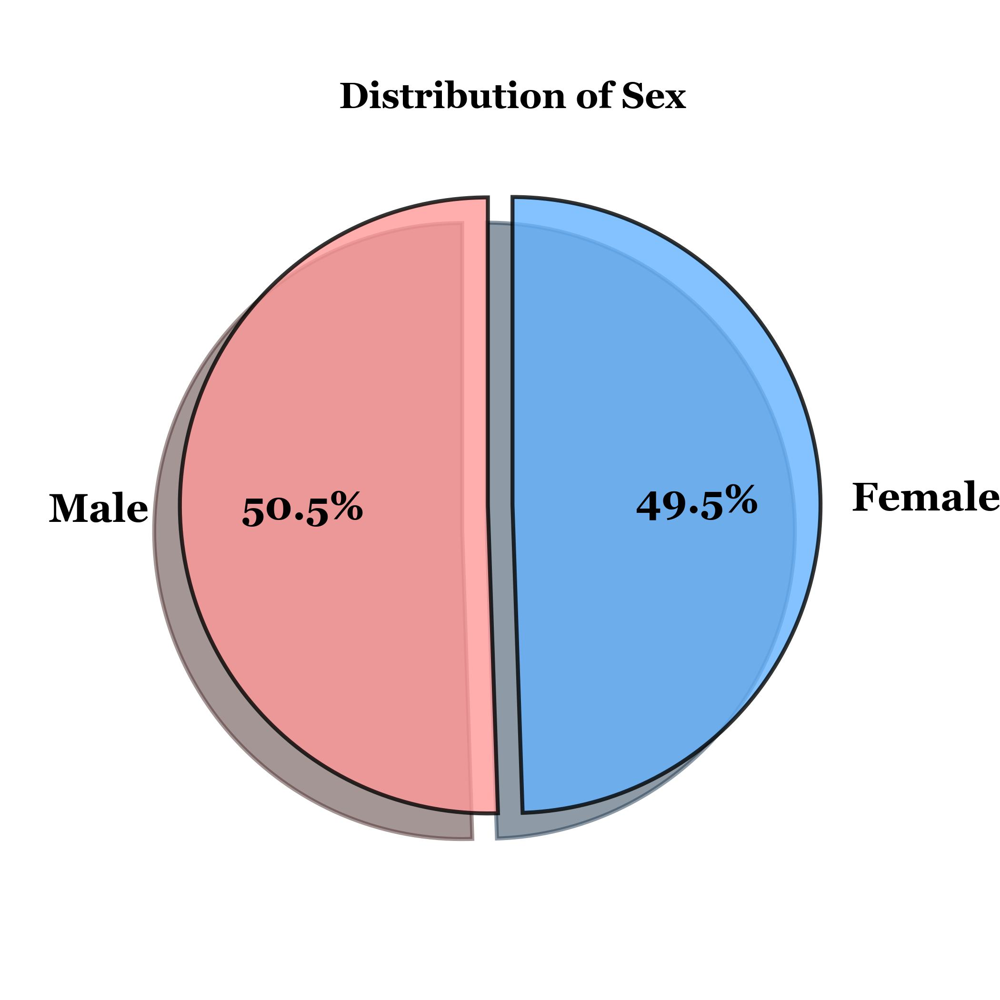
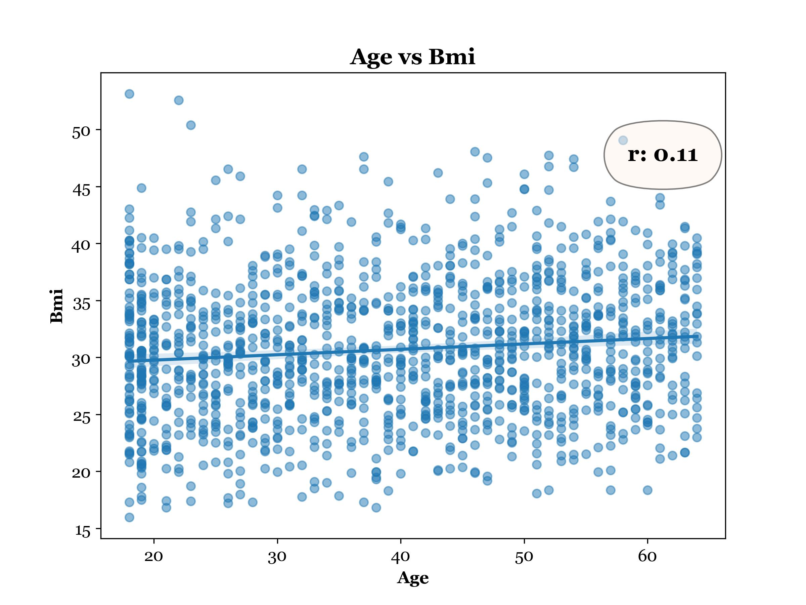
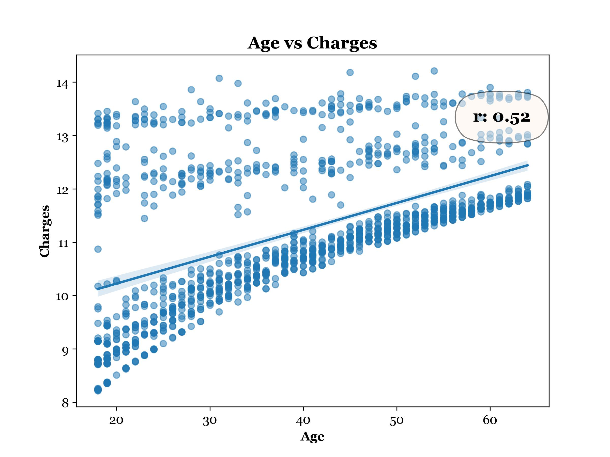
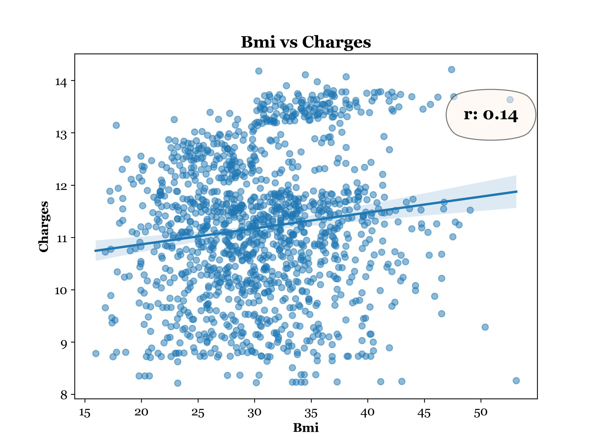
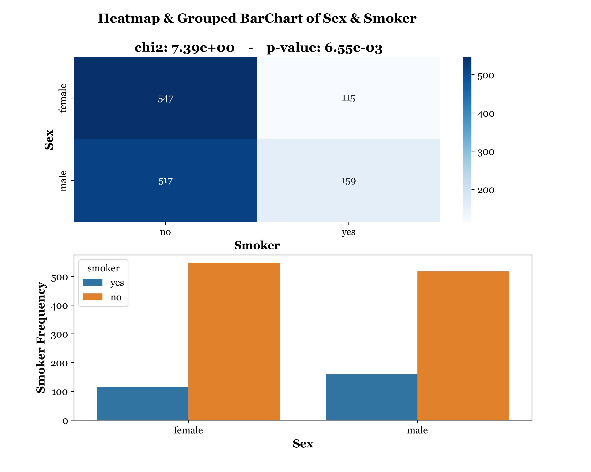
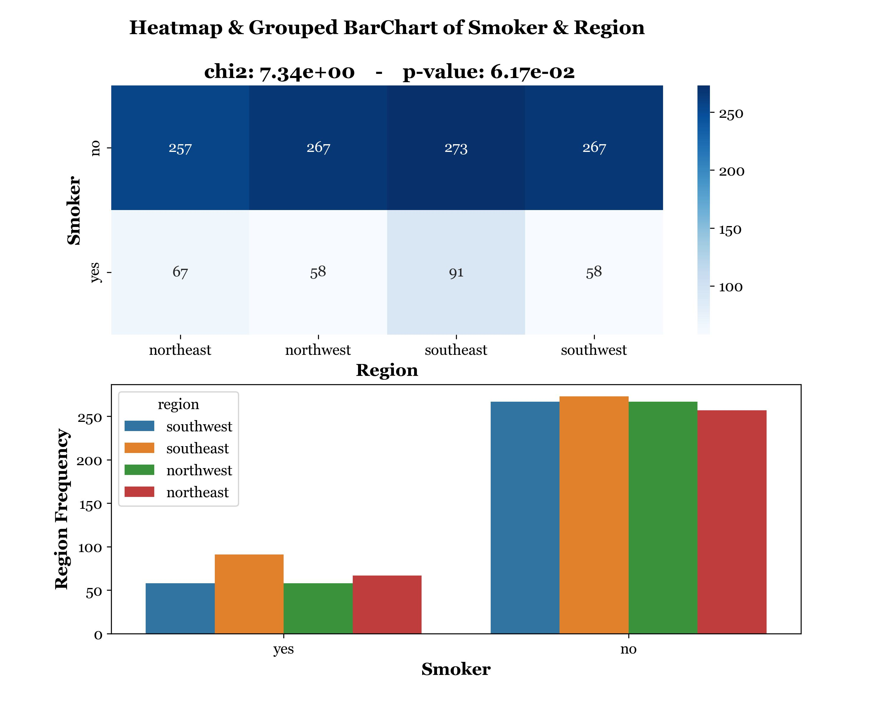
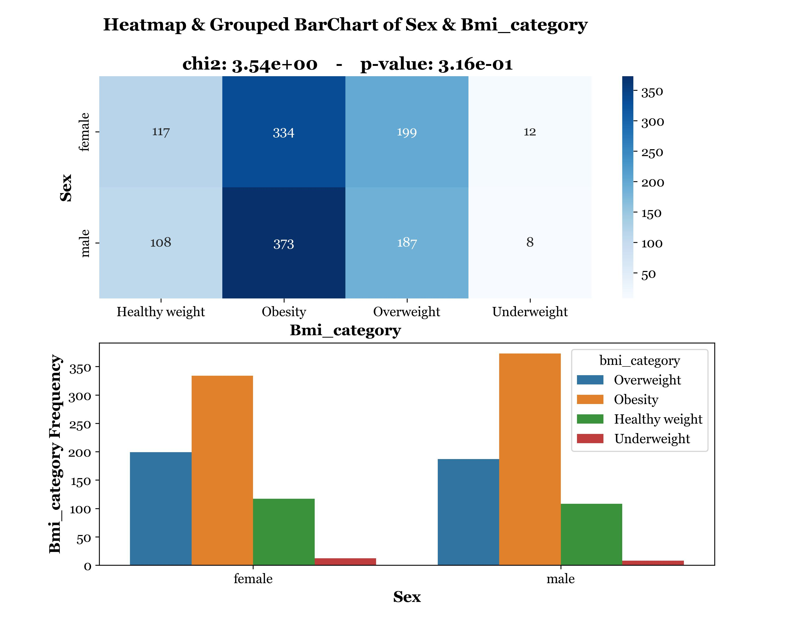
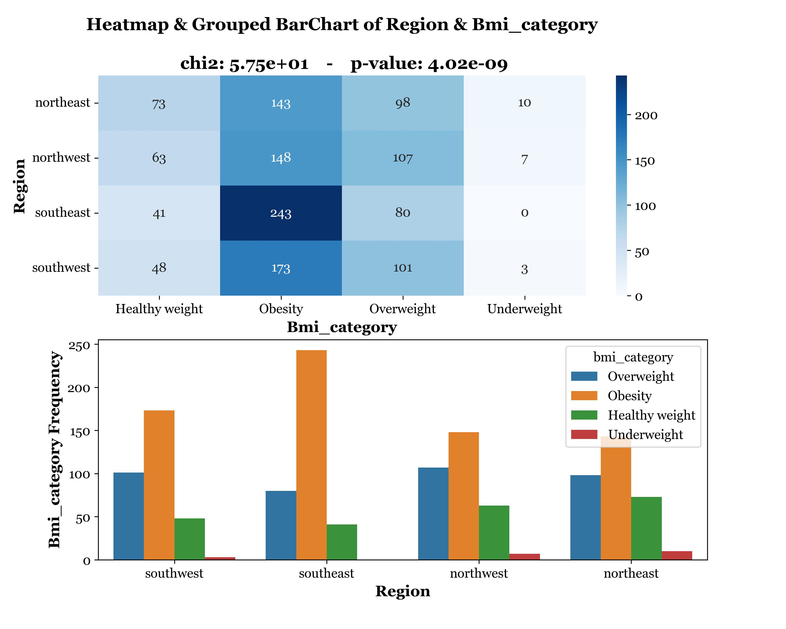

# Insurance Dataset — Statistical Analysis

This project performs **univariate, bivariate, and inferential statistical analysis** on a health insurance dataset. The goal is to uncover patterns and relationships between policyholder attributes — such as age, BMI, charges, sex, and region — and to test specific research questions using both parametric and nonparametric statistical methods.

The analysis is organized into three parts:

- **Part I — Univariate & Bivariate Analysis:** Descriptive statistics and visualizations for continuous and categorical variables, plus correlation and association analysis between variable pairs.
- **Part II — Parametric Testing:** An independent two-sample t-test investigating whether average BMI differs significantly between male and female policyholders.
- **Part III — Nonparametric Testing:** A Chi-Square Test of Independence examining whether BMI category is associated with U.S. region.

> **Note on Dataset Availability**
> The raw CSV file has been removed from this repository as the data is proprietary and cannot be shared publicly. All descriptive visualizations generated during the analysis have been retained in the `Figures/` folder for reference and presentation purposes.

---

## Analysis Summary

### Part I — Descriptive Statistics

#### Univariate Analysis
Continuous variables (`Age`, `Charges`) are summarized with mean, median, mode, standard deviation, min, max, and skewness, and visualized with histograms and KDE plots.

| Age Distribution | Charges Distribution |
|---|---|
|   |   |

Categorical variables (`Sex`, `Region`) are summarized with frequency counts and mode, and visualized with bar or pie charts.

 

#### Bivariate Analysis
Continuous variable pairs are analyzed using Pearson correlation — with automatic Box-Cox transformation applied to columns with absolute skew > 1 (e.g., `Charges`) — and visualized with scatterplots with trendlines.

| Age vs. BMI | Age vs. Charges | BMI vs. Charges |
|---|---|---|
|  |  |  |

Categorical variable pairs are analyzed using cross-tabulation and Chi-Square tests, and visualized with grouped bar charts or heatmaps.

| Sex vs. Smoker | Sex vs. Region |
|---|---|
|  |  |

---

### Part II — Parametric Test: Independent Two-Sample t-Test

**Research Question:** Is there a statistically significant difference in average BMI between male and female policyholders?

- **Result:** p-value = 0.09 > 0.05 → Fail to reject H₀
- **Conclusion:** No statistically significant difference in mean BMI between males and females at the 5% significance level.

| t-Test Results |
|---|
|  |

---

### Part III — Nonparametric Test: Chi-Square Test of Independence

**Research Question:** Is there a significant association between U.S. region and BMI category among policyholders?

- **Result:** χ² = 57.52, p-value = 4.015e-09 < 0.05 → Reject H₀
- **Conclusion:** There is a statistically significant association between region and BMI category.

| Chi-Square Results |
|---|
|  |

---

## How to Run

### Prerequisites

```bash
pip install -r requirements.txt
```

### Dataset Setup

Place the dataset CSV inside the `data/` folder:

```
project/
├── data/
│   └── your_dataset.csv        ← put it here
├── main.py
├── requirements.txt
└── README.md
```

### Run

```bash
python main.py
```

The script handles all analysis and visualization steps automatically. Results and plots are saved to the `Figures/` folder.

---

## Project Structure

```
project/
├── data/                   # Raw input dataset (not included — see note above)
├── Figures/                 # Generated plots and statistical results
├── main.py                 # Entry point — run this
├── requirements.txt
└── README.md
```
